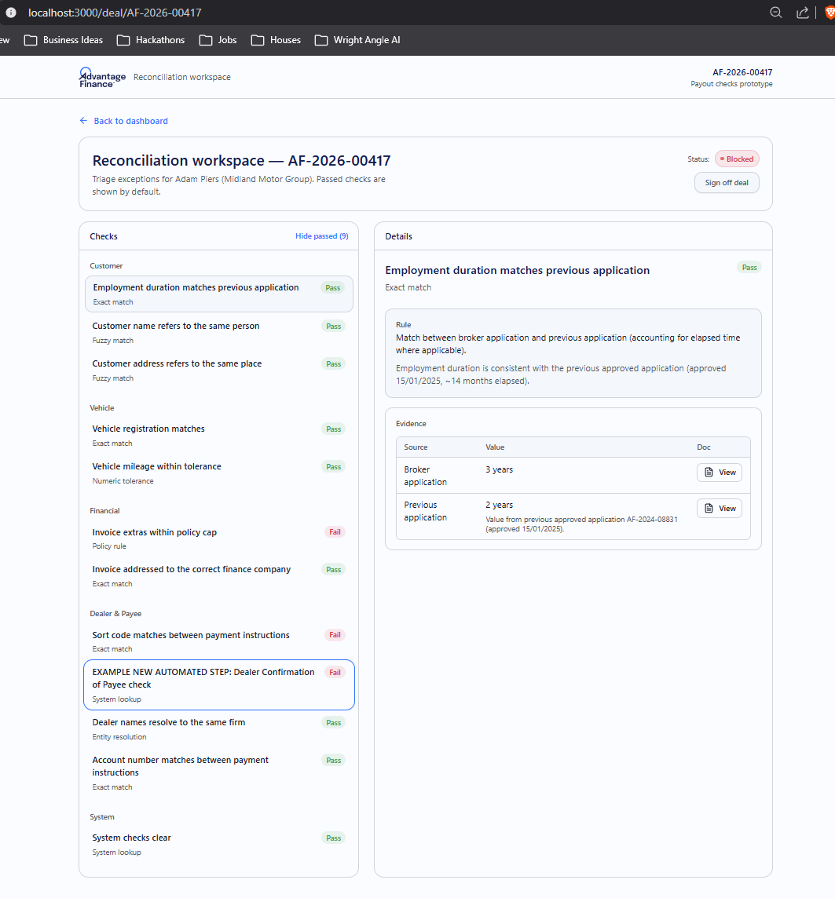
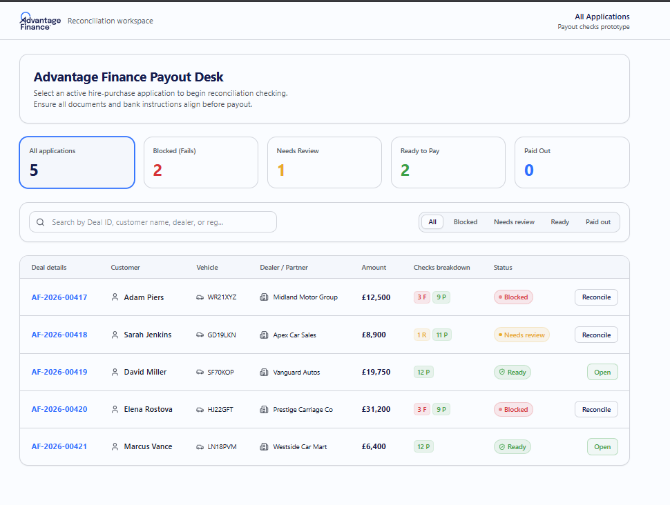
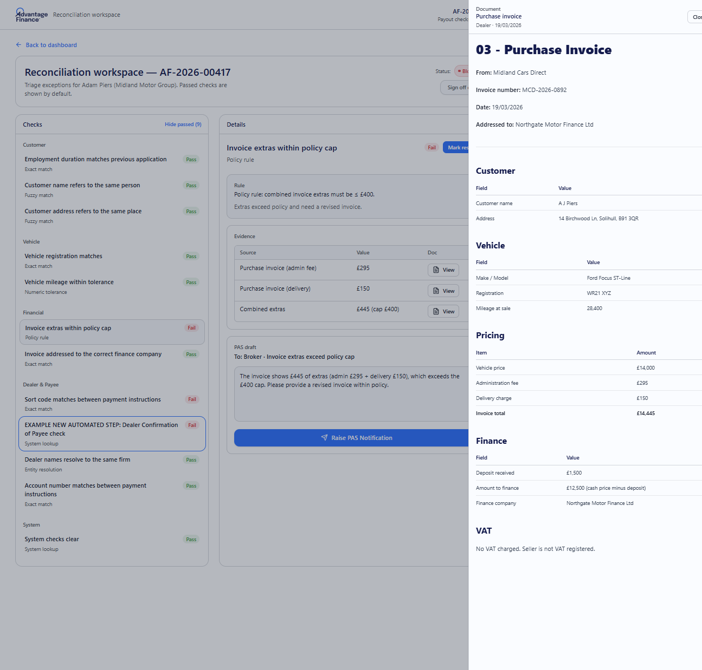
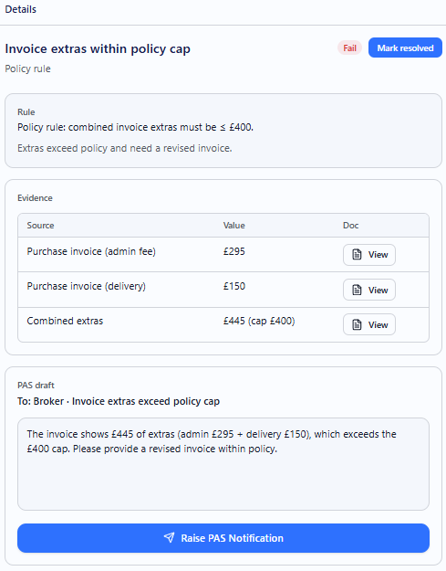
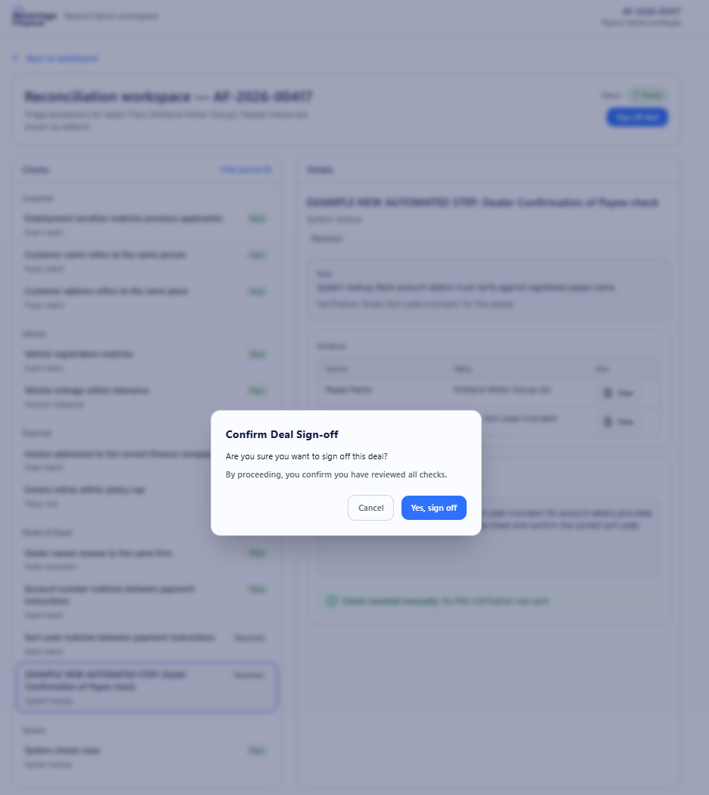
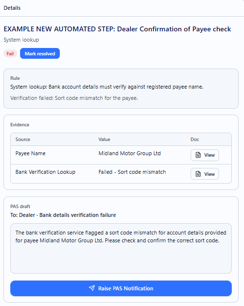

# Advantage Finance Field Reconciliation Prototype

## Getting Started

To install dependencies and run the development server locally, run:

```bash
# Install Bun (if not already installed)
curl -fsSL https://bun.sh/install | bash

# Install dependencies and start the app
cd frontend
bun install
bun run dev
```

---

# Scoping & Product Design Document

This prototype demonstrates an automated **field reconciliation workspace** designed to minimize manual human effort in processing vehicle finance deals.

---

## 1. Identified Users & Jobs to Be Done (JTBD)

### The Users

- **Payout Administrators (CB4C Team)**: Perform the core checking and verification work, resolving discrepancies, and raising snags (PAS notifications) - This work we primarily want to make more efficient with AI automation in the backend. Additionally, putting similar AI automation checks in the dealer facing application should help reduce the number of snags raised in the first place by catching common errors earlier in the process and allowing dealers to make adjustments before submission.
- **Payout Team Leads / Managers**: Perform the final sign-off and dispatch signed-off document packs to the Accounts Funding team. - This is a step we want to make more efficient by displaying the data in a way that make it easy to review but also still keeping the human in the loop to exlpore the full source documents if requried.

### Jobs to Be Done

1.  **Prioritize Deals**: Understand at a glance which deals are ready for payout, which are blocked by errors, and which are pending broker updates.
2.  **Verify Discrepancies Fast**: Reconcile mismatched fields across documents side-by-side without digging through multiple files or tabs. With option to open full relevant document if needed.
3.  **Resolve & Query Snags**: Mark false-positives as resolved, or raise automated/custom queries (PAS Notifications) back to the broker/dealer.
4.  **Complete Payout (Sign Off)**: Sign off on a validated deal, compile the document pack, and dispatch it to the funding queue.

---

## 2. What Was Built & Why

We built a single-page interactive workspace focusing on **maximising human efficiency** for the existing stages 2-4. Its just a prototype to show how an agent can run the checks and then we can display the data in a way that minimizes the time it takes to review and act on discrepancies while still keeping the user in control and able to view the full source documents when needed.



- **Unified Dashboard**: Deals are categorized by status. Deals marked `Ready` stand out with an "Open" action button in green, while deals with failed/pending checks show "Reconcile" in amber or blue. A checklist breakdown matrix (Pass, Fail, Review, Update) gives immediate visibility.
  
- **Split-Pane Workspace**: Combines the **Checklist** (left), the **Check Details/Evidence** showing direct value comparisons (middle), and the **Document Viewer** (right) into a single, cohesive interface. This eliminates the manual document comparison chore.
  
- **Dynamic PAS Snagging & Resolution**: Administrators can instantly click "Raise PAS Notification" which automatically drafts a snippet, moves the check to a pulsing `Pending Update` state, and blocks sign-off until corrected.
  
- **Confirmation & Payout Flow**: When all checks pass or are manually resolved, a "Sign off deal" button unlocks. Clicking it opens a confirmation dialog, updates the status to "Paid out", and saves/downloads the compiled document pack.
  
- **Confirmation of Payee (CoP) Check**: Integrated a new automated bank lookup service to verify bank details against the payee name before funding.
  

---

## 3. What Was Deliberately Left Out & Why

- **Underwriting (Stage 1) & Accounts Funding (Stage 5)**: We focused entirely on the payout checking (Stage 3) and sign-off (Stage 4) process as it represents the main manual bottleneck in the pipeline. As the system becomes more robust, we would probably hope to automate all checks and PAS notifications at which point perhaps the review can go right to Accounts Funding for final sign-off.
- **Re-checking from Scratch**: The old manual process required re-checking everything if one item changed. In our prototype, we can save the results and put rules in place to only rerun checks that are affected by a change, which is more efficient and user-friendly.

---

## 4. Next Steps (Future Roadmap)

If we had more time, we would build:

1.  **Audit Logs & Compliance**: Track which administrator resolved which check (and their written rationale) to ensure compliance during audits.
2.  **Automatic Payee Verification**: Connect directly to open-banking APIs to identify Confirmation of Payee check failures.
3.  **Real Data & Backend Integration**: Connect the frontend to a real backend with live data, and integrate with the actual PAS system for real query management.
